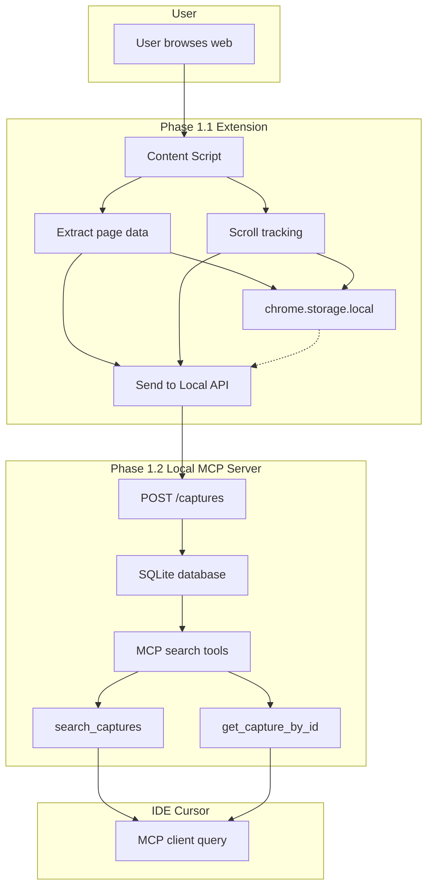

# SurfRAG

A local-first web knowledge Q&A system powered by LightRAG and MCP. Syncs your browsing history to a local knowledge graph and enables context-aware answers directly in your IDE.

## Project Architecture



## Requirements

- Windows 11
- Node.js v20 LTS
- pnpm
- Chrome

## Port Configuration

The extension sends captured page data to the local API. Both components must use the same base URL (host + port).

| Component        | Default URL           | Config Location                                      |
|------------------|-----------------------|------------------------------------------------------|
| local-mcp-server | `http://localhost:3030` | `services/local-mcp-server/.env` (`PORT`)            |
| Extension        | `http://localhost:3030` | Chrome popup → **Local API Base URL** → Save API URL |

**Server:** Create `services/local-mcp-server/.env` from the example and set `PORT=3030` (or your preferred port):

```powershell
Copy-Item services/local-mcp-server/.env.example services/local-mcp-server/.env
```

**Extension:** Click the SurfRAG icon in the Chrome toolbar, enter the API base URL (e.g. `http://localhost:3030`), then click **Save API URL**. The default is `http://localhost:3030`.

## Usage

### End Users (Run Pre-built)

1. **Start the local server** (required; must stay running):

   ```powershell
   Set-Location services/local-mcp-server
   pnpm install
   pnpm build
   pnpm start
   ```

2. **Load the extension in Chrome**:
   - Open `chrome://extensions/`
   - Enable "Developer mode"
   - Click "Load unpacked"
   - Select `extension/surfrag-extension/build/chrome-mv3-prod/`

3. **Configure the API URL** (if not using default): Click the SurfRAG icon, enter your server URL (e.g. `http://localhost:3030`), and click **Save API URL**.

4. Browse the web; the extension will capture pages and sync them to the local server.

### Developers (Build from Source)

1. **Install dependencies**:

   ```powershell
   Set-Location extension/surfrag-extension; pnpm install
   Set-Location ../../services/local-mcp-server; pnpm install
   ```

2. **Run both servers** (in separate terminals):

   ```powershell
   # Terminal 1: Plasmo dev server (hot reload)
   Set-Location extension/surfrag-extension; pnpm dev

   # Terminal 2: Local MCP server
   Set-Location services/local-mcp-server; pnpm dev
   ```

3. **Load the extension** in Chrome:
   - Load the dev build from `extension/surfrag-extension/build/chrome-mv3-dev/`

4. **Configure the API URL** (if needed): Click the SurfRAG icon in the toolbar, set the Local API Base URL to match your server (default `http://localhost:3030`), and click **Save API URL**.
