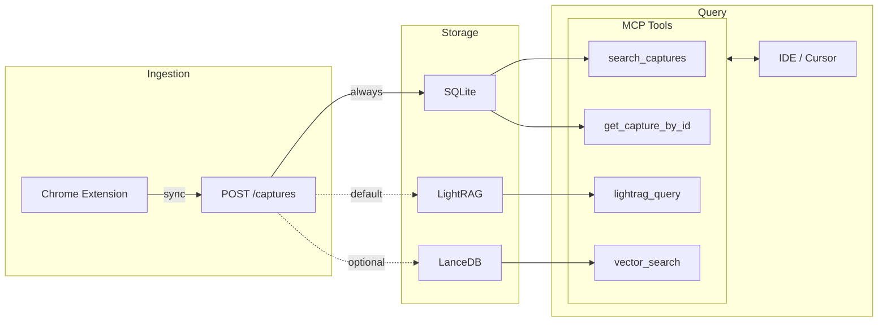
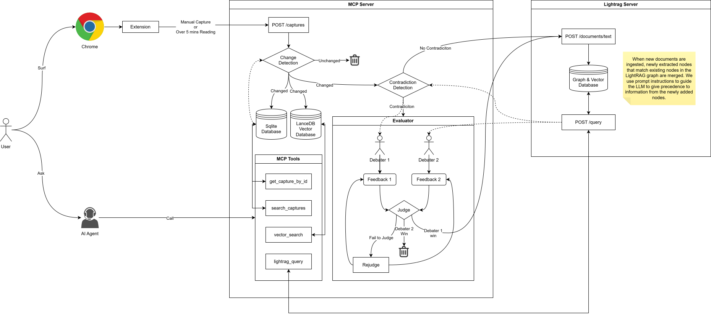

# SurfRAG

A local-first web knowledge Q&A system powered by LightRAG and MCP. Syncs your browsing history to a local knowledge graph and enables context-aware answers directly in your IDE.

## Project Architecture

### Dataflow


```mermaid
flowchart LR
    subgraph Ingest["Ingestion"]
        EXT["Chrome Extension"]
        HTTP["POST /captures"]
        EXT -->|"sync"| HTTP
    end

    subgraph Storage["Storage"]
        SQLITE["SQLite"]
        LR["LightRAG"]
        LANCEDB["LanceDB"]
    end

    subgraph Query["Query"]
        subgraph Tools["MCP Tools"]
            T1["search_captures"]
            T2["lightrag_query"]
            T3["vector_search"]
            T4["get_capture_by_id"]
        end
        IDE["IDE / Cursor"]
        Tools <--> IDE
    end

    HTTP -->|"always"| SQLITE
    HTTP -.->|"default"| LR
    HTTP -.->|"optional"| LANCEDB

    SQLITE --> T1 & T4
    LR --> T2
    LANCEDB --> T3
```

### Framework



## Requirements

- Windows 11
- Node.js v20 LTS
- pnpm
- Chrome
- **LightRAG (default):** uv, Python 3.10-3.12, bun — see [env3-2.md](phases/phase3/phase3-2/env3-2.md)

## Submodules

This repo uses git submodules (LightRAG in `services/lightrag/`). After cloning, run:

```powershell
git submodule update --init --recursive
```

Or clone with submodules in one step:

```powershell
git clone --recurse-submodules <repo-url>
```

## Port Configuration

The extension sends captured page data to the local API. Both components must use the same base URL (host + port).

| Component        | Default URL           | Config Location                                      |
|------------------|-----------------------|------------------------------------------------------|
| local-mcp-server | `http://localhost:3030` | `services/local-mcp-server/.env` (`PORT`)            |
| LightRAG server  | `http://localhost:9621` | `services/lightrag/.env`                             |
| Extension        | `http://localhost:3030` | Chrome popup → **Local API Base URL** → Save API URL |

**Server:** Create `services/local-mcp-server/.env` from the example:

```powershell
Copy-Item services/local-mcp-server/.env.example services/local-mcp-server/.env
```

**Extension:** Click the SurfRAG icon in the Chrome toolbar, enter the API base URL (e.g. `http://localhost:3030`), then click **Save API URL**. The default is `http://localhost:3030`.

## Environment Configuration

### local-mcp-server (.env)

Create `services/local-mcp-server/.env` from `.env.example` and configure:

| Variable | Default | Description |
|----------|---------|-------------|
| `PORT` | `3030` | HTTP server port. Extension must use same base URL. |
| `DB_PATH` | `./data/surfrag.db` | SQLite database path for capture metadata. |
| `EMBED_PROVIDER` | `glm` | Embedding provider. Currently implemented: `glm` |
| `EMBED_API` | — | API key for embeddings. GLM: [智谱 AI 开放平台](https://open.bigmodel.cn/) |
| `EMBED_MODEL` | `embedding-2` | Model name (e.g. `embedding-2` for GLM) |
| `LLM_API_KEY` | — | API key for MCP-side LLM calls such as claim extraction |
| `LLM_API_PROVIDER` | `glm` | LLM provider for MCP-side structured generation. Currently implemented: `glm` |
| `LLM_MODEL` | `glm-4-flash` | LLM model used for MCP-side claim extraction |
| `VECTOR_DB_PATH` | `./data/lancedb` | Directory for LanceDB vector storage |
| `VECTOR_DB_ENABLED` | `false` | Store captures in LanceDB (vector search). `true` to enable as second choice. |
| `SEARCH_CAPTURES_ENABLED` | `false` | Show `search_captures` MCP tool (keyword search). Set `true` to enable. |
| `VECTOR_SEARCH_ENABLED` | `false` | Show `vector_search` MCP tool. Set `true` when using vector search. Requires `VECTOR_DB_ENABLED` and `EMBED_API`. |
| `LIGHTRAG_INSERT_ENABLED` | `true` | Sync captures to LightRAG (default). Set `false` to disable. |
| `LIGHTRAG_QUERY_ENABLED` | `true` | Enable `lightrag_query` MCP tool. Set `false` to hide. |
| `LIGHTRAG_URL` | `http://localhost:9621` | LightRAG API base URL. Start LightRAG server first. |
| `LIGHTRAG_API_KEY` | — | Optional. LightRAG API key (X-API-Key header) when auth is enabled. |

**Default setup (LightRAG):** Start the LightRAG server, then the MCP server. Captures sync to LightRAG by default. Keyword search always available.

**Keyword/vector search (optional):** Set `SEARCH_CAPTURES_ENABLED=true` for keyword search, or `VECTOR_SEARCH_ENABLED=true` + `VECTOR_DB_ENABLED=true` + `EMBED_API` for vector search. `get_capture_by_id` is only enabled when either is enabled.

**Claim extraction:** Phase 5.3 now uses an MCP-side LLM call to extract candidate claims before contradiction review. Configure `LLM_API_KEY`, `LLM_API_PROVIDER`, and `LLM_MODEL` for this path.

### LightRAG (.env)

For graph-based RAG, configure `services/lightrag/.env` (copy from `env.example`):

| Variable | Default | Description |
|----------|---------|-------------|
| `PORT` | `9621` | LightRAG API server port |
| `WORKING_DIR` | `./data/lightrag` | Storage for graph and vectors |
| `LLM_BINDING` | `openai` | LLM provider: `openai`, `ollama`, `gemini`, etc. |
| `LLM_BINDING_API_KEY` | — | API key for LLM |
| `EMBEDDING_BINDING` | `openai` | Embedding provider for entity extraction |

See `services/lightrag/env.example` for full options.

## Usage

### Extension

#### End Users

1. **Load the extension** in Chrome:
   - Open `chrome://extensions/`
   - Enable "Developer mode"
   - Click "Load unpacked"
   - Select `extension/surfrag-extension/build/chrome-mv3-prod/`

2. **Configure the API URL** (if not using default): Click the SurfRAG icon, enter your server URL (e.g. `http://localhost:3030`), and click **Save API URL**.

3. Browse the web; the extension will capture pages and sync them to the local server.

#### Developers

1. **Install dependencies**:

   ```powershell
   Set-Location extension/surfrag-extension; pnpm install
   Set-Location ../../services/local-mcp-server; pnpm install
   ```

2. **Run the Plasmo dev server** (hot reload):

   ```powershell
   Set-Location extension/surfrag-extension; pnpm dev
   ```

3. **Load the extension** in Chrome:
   - Load the dev build from `extension/surfrag-extension/build/chrome-mv3-dev/`

4. **Configure the API URL** (if needed): Click the SurfRAG icon in the toolbar, set the Local API Base URL to match your server (default `http://localhost:3030`), and click **Save API URL**.

### LightRAG Server (Default)

LightRAG is the default retrieval backend—graph-based RAG with entity extraction. Run it as a separate process alongside the local MCP server.

**Prerequisites:** uv, Python 3.10-3.12, bun — see [env3-2.md](phases/phase3/phase3-2/env3-2.md) to verify or install.

**First-time setup:**

```powershell
Set-Location services/lightrag
uv sync --extra api
Set-Location lightrag_webui; bun install --frozen-lockfile; bun run build; Set-Location ..
Copy-Item env.example .env
# Edit .env with your LLM and embedding API keys
```

**Run the server:**

```powershell
Set-Location services/lightrag
uv run lightrag-server
```

### Service

Start the local MCP server (required for the extension to sync captures). It must stay running.

```powershell
Set-Location services/local-mcp-server
pnpm install
pnpm build
pnpm start
```

**Dev mode** (hot reload):

```powershell
Set-Location services/local-mcp-server; pnpm dev
```

### Add MCP to Your Agent

To use the SurfRAG MCP tools in Cursor or other MCP clients, add the server to your MCP configuration.

**Tools:** `lightrag_query` (graph RAG, default), `search_captures` (keyword, optional), `vector_search` (semantic, optional), `get_capture_by_id` (only when search_captures or vector_search enabled)

Cursor uses `~/.cursor/mcp.json` (global) or the MCP section in Cursor Settings.

Example JSON (replace `YOUR_WORKSPACE_PATH` with the absolute path to this repo, e.g. `D:/surfrag`):

```json
{
  "mcpServers": {
    "surfrag-local": {
      "command": "node",
      "args": ["YOUR_WORKSPACE_PATH/services/local-mcp-server/dist/mcp/server.js"],
      "env": {
        "DB_PATH": "YOUR_WORKSPACE_PATH/services/local-mcp-server/data/surfrag.db",
        "LIGHTRAG_URL": "http://localhost:9621",
        "VECTOR_DB_PATH": "YOUR_WORKSPACE_PATH/services/local-mcp-server/data/lancedb"
      }
    }
  }
}
```

When Cursor runs MCP, `cwd` may differ. Pass `DB_PATH` as absolute path. `LIGHTRAG_URL` is required for LightRAG (default). Optional: `VECTOR_SEARCH_ENABLED`, `VECTOR_DB_PATH`, `VECTOR_DB_ENABLED`, and `EMBED_API` for vector search. Start LightRAG server before the MCP server.
