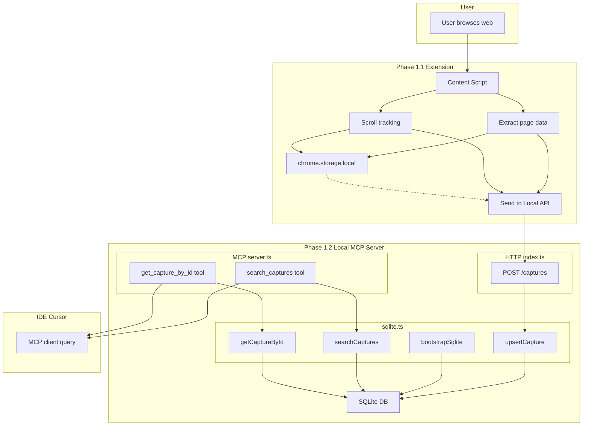

# SurfRAG

A local-first web knowledge Q&A system powered by LightRAG and MCP. Syncs your browsing history to a local knowledge graph and enables context-aware answers directly in your IDE.

## Project Architecture


```mermaid
flowchart TB
    subgraph "User"
        A[""User browses web""]
    end

    subgraph "Phase 1.1 Extension"
        B[""Content Script""]
        C[""Extract page data""]
        D[""Scroll tracking""]
        E[""chrome.storage.local""]
        F[""Send to Local API""]
    end

    subgraph "Phase 1.2 Local MCP Server"
        subgraph "HTTP index.ts"
            G[""POST /captures""]
        end
        subgraph "sqlite.ts"
            H1[""bootstrapSqlite""]
            H2[""upsertCapture""]
            H3[""searchCaptures""]
            H4[""getCaptureById""]
        end
        subgraph "MCP server.ts"
            I[""search_captures tool""]
            J[""get_capture_by_id tool""]
        end
        K[""SQLite DB""]
    end

    subgraph "IDE Cursor"
        L[""MCP client query""]
    end

    A --> B
    B --> C
    B --> D
    C --> E
    C --> F
    D --> E
    D --> F
    E -.-> F
    F --> G
    G --> H2
    H2 --> K
    H1 --> K
    I --> H3
    H3 --> K
    J --> H4
    H4 --> K
    I --> L
    J --> L
```

## Requirements

- Windows 11
- Node.js v20 LTS
- pnpm
- Chrome

## Port Configuration

The extension sends captured page data to the local API. Both components must use the same base URL (host + port).

| Component        | Default URL           | Config Location                                      |
|------------------|-----------------------|------------------------------------------------------|
| local-mcp-server | `http://localhost:3030` | `services/local-mcp-server/.env` (`PORT`)            |
| Extension        | `http://localhost:3030` | Chrome popup → **Local API Base URL** → Save API URL |

**Server:** Create `services/local-mcp-server/.env` from the example and set `PORT=3030` (or your preferred port):

```powershell
Copy-Item services/local-mcp-server/.env.example services/local-mcp-server/.env
```

**Extension:** Click the SurfRAG icon in the Chrome toolbar, enter the API base URL (e.g. `http://localhost:3030`), then click **Save API URL**. The default is `http://localhost:3030`.

## Usage

### Extension

#### End Users

1. **Load the extension** in Chrome:
   - Open `chrome://extensions/`
   - Enable "Developer mode"
   - Click "Load unpacked"
   - Select `extension/surfrag-extension/build/chrome-mv3-prod/`

2. **Configure the API URL** (if not using default): Click the SurfRAG icon, enter your server URL (e.g. `http://localhost:3030`), and click **Save API URL**.

3. Browse the web; the extension will capture pages and sync them to the local server.

#### Developers

1. **Install dependencies**:

   ```powershell
   Set-Location extension/surfrag-extension; pnpm install
   Set-Location ../../services/local-mcp-server; pnpm install
   ```

2. **Run the Plasmo dev server** (hot reload):

   ```powershell
   Set-Location extension/surfrag-extension; pnpm dev
   ```

3. **Load the extension** in Chrome:
   - Load the dev build from `extension/surfrag-extension/build/chrome-mv3-dev/`

4. **Configure the API URL** (if needed): Click the SurfRAG icon in the toolbar, set the Local API Base URL to match your server (default `http://localhost:3030`), and click **Save API URL**.

### Service

Start the local server (required for the extension to sync captures). It must stay running.

```powershell
Set-Location services/local-mcp-server
pnpm install
pnpm build
pnpm start
```

**Dev mode** (hot reload):

```powershell
Set-Location services/local-mcp-server; pnpm dev
```

### Add MCP to Your Agent

To use the SurfRAG MCP tools (`search_captures`, `get_capture_by_id`) in Cursor or other MCP clients, add the server to your MCP configuration.

Cursor uses `~/.cursor/mcp.json` (global) or the MCP section in Cursor Settings.

Example JSON (replace `YOUR_WORKSPACE_PATH` with the absolute path to this repo, e.g. `D:/surfrag`):

```json
{
  "mcpServers": {
    "surfrag-local": {
      "command": "node",
      "args": ["YOUR_WORKSPACE_PATH/services/local-mcp-server/dist/mcp/server.js"],
      "env": {
        "DB_PATH": "YOUR_WORKSPACE_PATH/services/local-mcp-server/data/surfrag.db"
      }
    }
  }
}
```
