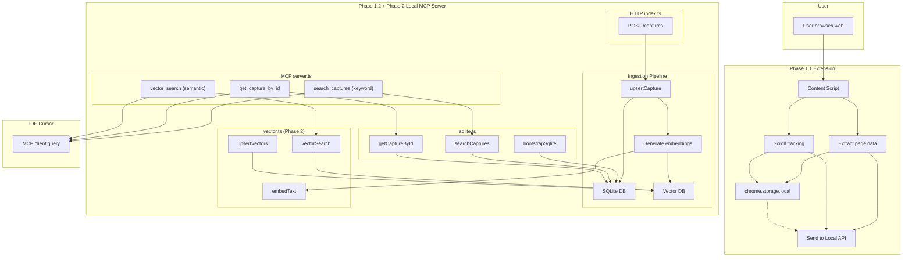

# Phase 2: Vector Search & Semantic Retrieval

Add semantic search over captured web pages using embeddings and a vector database. This complements the existing keyword search (Phase 1.2) and enables RAG-style retrieval by meaning, not just exact text matches.

## Goals

- **Semantic search:** Find captures by conceptual similarity (e.g., "machine learning tutorials" matches pages about neural networks, deep learning).
- **Hybrid retrieval:** Combine keyword search (SQLite) with vector similarity for better recall.
- **Local-first (storage):** Keep vector storage on-device; embeddings via OpenAI API (avoids weak-GPU local inference).
- **Incremental indexing:** Generate embeddings and index new captures as they arrive via `POST /captures`.

---

## Architecture (with Vector Database)



### Where the Vector Database Fits

| Component | Role |
|-----------|------|
| **Ingestion** | After `upsertCapture` writes to SQLite, the pipeline chunks `bodyText` (if needed), calls the embedding model, and writes vectors to the vector DB with `capture_id` as metadata. |
| **Search** | New MCP tool `vector_search(query, limit)` embeds the query, runs similarity search in the vector DB, then joins with SQLite to fetch full capture metadata (title, url, snippet). |
| **Co-location** | Vector DB runs inside the same Node.js process as the local-mcp-server. No separate service. |

### Data Flow

1. **Capture arrives** → SQLite (metadata + full text) + Embedding model → Vector DB (embeddings + `capture_id`).
2. **Keyword search** → SQLite only (unchanged).
3. **Semantic search** → Embed query → Vector DB similarity → SQLite for metadata.
4. **Hybrid (future)** → Merge and re-rank results from both paths.

---

## Tech Stack Options

### 1. Vector Database

| Option | Pros | Cons |
|--------|------|------|
| **sqlite-vec** | Single file, same DB as captures, no extra process, SQL-native, good for small–medium datasets | Newer ecosystem, fewer features than dedicated vector DBs |
| **LanceDB** | Embedded, file-based, fast, good Node bindings, no server | Less mature than Chroma/Qdrant, smaller community |
| **Chroma** | Popular, Python-first but has JS client, in-memory or persistent | Heavier, Python runtime often assumed; JS client less polished |
| **Qdrant** | Production-grade, filtering, hybrid search | Typically runs as separate server; overkill for local MVP |
| **Milvus** | Scalable, enterprise features | Heavy, requires separate service; not suitable for local-first |
| **pgvector (PostgreSQL)** | Mature, SQL, good tooling | Requires PostgreSQL; breaks "zero-setup" local story |
| **Memory (in-process)** | Simplest, no extra deps | No persistence; lost on restart; only for prototyping |

**Recommendation for Phase 2:** **sqlite-vec** or **LanceDB**. sqlite-vec keeps everything in one SQLite file and aligns with the existing stack. LanceDB is a strong alternative if you want a dedicated vector store with minimal setup.

---

### 2. Embedding Model

| Option | Pros | Cons |
|--------|------|------|
| **Ollama + nomic-embed-text** | Local, no API key, good quality, runs via HTTP | Requires Ollama; weak GPU = slow inference |
| **Ollama + mxbai-embed-large** | Strong multilingual, local | Same Ollama + GPU dependency |
| **@xenova/transformers.js** | Pure JS/Node, no Python, runs in-process | Slow on weak GPU; high memory usage |
| **OpenAI text-embedding-3-small** | High quality, fast, no local GPU needed, simple API | Requires API key, network, cost per token |
| **OpenAI text-embedding-3-large** | Best quality | Higher cost, slower |
| **Cohere embed-v3** | Good quality, competitive pricing | API dependency, network |
| **sentence-transformers (Python)** | Excellent local models, mature | Requires Python + GPU; weak GPU = slow |

**Recommendation for Phase 2:** **OpenAI text-embedding-3-small**. Offloads embedding to the cloud, avoids weak-GPU bottlenecks, and keeps the Node service lightweight. Requires `OPENAI_API_KEY` in `.env`.

---

### 3. Chunking Strategy

| Option | Pros | Cons |
|--------|------|------|
| **Whole page** | Simple, one embedding per capture, no chunk boundaries | Long pages exceed typical model context; less precise retrieval |
| **Fixed-size chunks (e.g., 512 tokens)** | Predictable, works with any model | Can split sentences/paragraphs; no semantic boundaries |
| **Sentence/paragraph split** | Respects natural boundaries | More logic; variable chunk sizes |
| **Recursive character split** | Configurable separators, predictable chunks | Tuning needed; may still cut mid-sentence |
| **Semantic chunking (e.g., by embedding similarity)** | Chunks align with topic shifts | More compute; slower indexing |

**Recommendation for Phase 2:** Start with **whole page** for MVP (captures are often 1–5K tokens). Add **fixed-size or recursive split** (e.g., 512 tokens, 64 overlap) if long pages hurt quality.

---

### 4. Runtime / Integration

| Aspect | Current (Phase 1) | Phase 2 Addition |
|--------|-------------------|------------------|
| **Process** | Single Node.js process (HTTP + MCP) | Same; embedding + vector ops in-process |
| **Async** | Sync SQLite | Embedding calls are async; ingestion should not block HTTP response |
| **Config** | `PORT`, `DB_PATH` | Add `OPENAI_API_KEY`, `VECTOR_DB_PATH` |

---

## Adaptability to Different LLMs (e.g., GLM)

SurfRAG interacts with LLMs in two places: (1) **embedding** (indexing and query encoding) and (2) **MCP tools** (retrieval consumed by the agent's LLM). To support GLM, local models, and other providers, both need to be swappable.

### 1. Where LLMs Touch SurfRAG

| Touchpoint | Role | LLM-specific? |
|------------|------|---------------|
| **Embedding API** | Encode text → vectors for indexing and search | Yes: OpenAI, GLM, Ollama, etc. have different APIs |
| **MCP tool schema** | Input/output format for `search_captures`, `vector_search`, `get_capture_by_id` | No: MCP is provider-agnostic; the client (Cursor) maps to each LLM's tool format |
| **Tool descriptions** | Help the LLM decide when and how to call tools | Partially: wording should be clear for any model (including Chinese LLMs like GLM) |

### 2. Embedding Provider Abstraction

Use a **provider-agnostic embedding interface** so you can swap between OpenAI, GLM, Ollama, etc. without changing the rest of the pipeline.

```
EmbeddingProvider interface:
  embed(text: string): Promise<number[]>
  embedBatch(texts: string[]): Promise<number[][]>
```

| Provider | API | Config |
|----------|-----|--------|
| **OpenAI** | `text-embedding-3-small` | `OPENAI_API_KEY`, `OPENAI_BASE_URL` (optional) |
| **GLM (智谱)** | `embedding-2` | `ZHIPU_API_KEY`, base URL for open.bigmodel.cn |
| **Ollama** | `nomic-embed-text` | `OLLAMA_BASE_URL` |
| **Cohere** | `embed-v3` | `COHERE_API_KEY` |

**Implementation:** One `EmbeddingProvider` per backend, selected via `EMBED_PROVIDER` (e.g. `openai`, `glm`, `ollama`). Each provider handles auth, request format, and response parsing.

### 3. GLM-Specific Notes

- **GLM Embedding API:** 智谱 AI (Zhipu) exposes `embedding-2` with a REST API similar to OpenAI. Dimensions and normalization may differ; keep vector DB dimension configurable.
- **Tool use:** GLM-4 supports function/tool calling. MCP clients that support GLM will map MCP tools to GLM's format; SurfRAG does not need GLM-specific logic.
- **Chinese support:** Tool descriptions should be clear enough for Chinese LLMs. Optionally add Chinese descriptions or keep English descriptions simple and universal.

### 4. Design Principles for LLM Adaptability

| Principle | Action |
|-----------|--------|
| **Abstract embedding** | Single `EmbeddingProvider` interface; pluggable implementations |
| **Config-driven provider** | `EMBED_PROVIDER=openai|glm|ollama` + provider-specific env vars |
| **Dimension flexibility** | Store embedding dimension in config; vector DB schema or index supports variable dimensions |
| **Neutral tool descriptions** | Avoid provider-specific wording; use generic terms (e.g. "search", "retrieve") |
| **Stable JSON output** | Return consistent JSON; any LLM can parse `id`, `title`, `url`, `snippet` |
| **Optional i18n** | Consider bilingual tool descriptions if targeting Chinese LLMs |

### 5. Example Config for Multi-Provider

```env
# Embedding provider: openai | glm | ollama
EMBED_PROVIDER=openai

# OpenAI (when EMBED_PROVIDER=openai)
OPENAI_API_KEY=sk-...

# GLM / 智谱 (when EMBED_PROVIDER=glm)
ZHIPU_API_KEY=...
EMBED_MODEL=embedding-2

# Ollama (when EMBED_PROVIDER=ollama)
OLLAMA_BASE_URL=http://localhost:11434
EMBED_MODEL=nomic-embed-text
```

### 6. Implementation Outline for Adaptability

1. Define `EmbeddingProvider` interface and implement `OpenAIEmbeddingProvider`.
2. Add `GLMEmbeddingProvider` (智谱 `embedding-2`).
3. Add `OllamaEmbeddingProvider` for local models.
4. Add provider factory: `getEmbeddingProvider(env)` → selected implementation.
5. Ensure vector DB supports configurable dimension (e.g. from provider or config).
6. Keep MCP tool schemas and descriptions provider-agnostic.

---

## Implementation Outline (Phase 2)

1. **Choose and integrate vector DB** (sqlite-vec or LanceDB).
2. **Choose and integrate embedding model** (OpenAI text-embedding-3-small).
3. **Extend ingestion:** After `upsertCapture`, chunk (if needed), embed, upsert vectors.
4. **Add MCP tool:** `vector_search(query, limit, since?)`.
5. **Optional:** Hybrid search tool combining keyword + vector results.
6. **Config and docs:** `.env` additions, README update.

---

## Deliverables for Phase 2

- Vector database integrated into local-mcp-server.
- Embedding pipeline for new captures (sync or async queue).
- MCP tool `vector_search` returning semantically similar captures.
- Documentation for embedding setup (OpenAI API key).
- Optional: hybrid search combining keyword + semantic.
