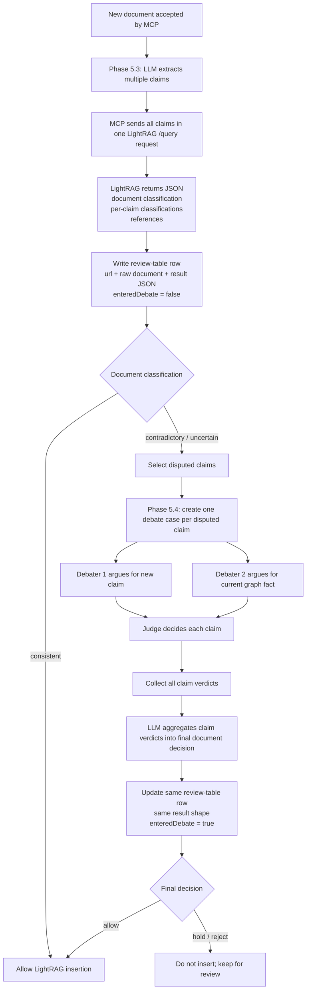

# Phase 5.3: Add Contradiction Detection

## Objective
Add a contradiction-detection gate in the MCP server so a newly accepted capture is not blindly inserted into LightRAG. Before LightRAG sync runs, the system should first extract a small set of candidate claims from the new document, then make a **single** structured LightRAG `/query` call that asks whether those claims contradict the current graph and requires a JSON response with both a **document-level classification** and **per-claim classifications** plus reference documents. The MCP server should then parse that JSON and only allow LightRAG insertion when the returned document-level result is safe enough to pass. If the document-level result is `contradictory` or `uncertain`, the contradictory claims should become the input cases for Phase 5.4 debate.

---

## Why This Phase Is Needed

Phase 5.1 and Phase 5.2 make changed-document ingestion easier to route and test, but they do not yet stop contradictory updates from entering the graph:

1. `services/local-mcp-server/src/index.ts` currently persists a changed capture and immediately queues LightRAG sync when the content hash changes.
2. `services/local-mcp-server/src/lightrag/sync.ts` now supports both `insert` and `overwrite-add`, but it still assumes every accepted changed capture is ready for graph insertion.
3. `services/local-mcp-server/src/lightrag/query.ts` can already query the existing LightRAG graph with references, but the ingestion path does not yet use that evidence to make a contradiction decision.
4. Phase 5 explicitly requires a classification layer before graph insertion so changed facts do not automatically overwrite or merge with existing knowledge.
5. Phase 5.4 needs a structured evidence packet from Phase 5.3; otherwise the debate step would have to rediscover the same claims and references from scratch.

So Phase 5.3 is really three tasks:

- extract or summarize the new document's candidate factual claims
- send those claims to LightRAG in one structured contradiction query and require a JSON result with both document-level and claim-level contradiction results
- parse that JSON result and either route the document into LightRAG or hand contradictory claims to Phase 5.4

---

## Scope

### In Scope

- Adding a contradiction-detection gate in the MCP server before LightRAG insertion
- Reusing current LightRAG query capabilities to ask for contradiction analysis and references in one call
- Defining the JSON response shape LightRAG should return for contradiction analysis
- Requiring one document-level result plus per-claim results in the same response
- Persisting one lightweight review-table row per candidate document
- Classifying document updates as `consistent`, `contradictory`, or `uncertain`
- Parsing the returned JSON to decide whether to continue, hold, or fail closed
- Preventing `contradictory` and `uncertain` cases from being inserted directly into LightRAG
- Passing contradictory or uncertain claims forward as the debate inputs for Phase 5.4
- Logging and test visibility for contradiction-detection outcomes

### Out of Scope

- Multi-round debate behavior and judge logic from Phase 5.4
- Final operator UX for manual review queues
- Changing LightRAG graph schema or storage structure
- Full historical audit ledger design beyond the minimum review packet needed for later phases

---

## Requirements

### Functional Requirements

1. Contradiction detection must run after the capture is accepted by the MCP server and before `syncCaptureToLightRAG()` inserts the document into LightRAG.
2. The detector must compare the new document against the current LightRAG graph rather than only against the previously stored raw capture row.
3. The detector must produce exactly one of these classifications for each candidate ingestion: `consistent`, `contradictory`, or `uncertain`.
4. The contradiction judgment and reference lookup should come back from a single LightRAG query response rather than separate MCP-side retrieval and classification steps.
5. The LightRAG query response must be machine-parseable JSON, not only free-form prose.
6. The JSON response must include both a document-level classification and a per-claim result array.
7. The JSON response must include enough supporting evidence for the classification to be inspectable by developers and reusable by Phase 5.4.
8. If the document-level result is `consistent`, the document may proceed to the normal LightRAG sync path.
9. If the document-level result is `contradictory` or `uncertain`, the document must not be inserted into LightRAG automatically.
10. When the document-level result is `contradictory` or `uncertain`, the MCP server should pass the contradictory or uncertain claim cases into Phase 5.4 for claim-level debate.
11. The main capture persistence path should remain non-destructive: the capture can still be stored in SQLite even when LightRAG insertion is blocked pending review.
12. Phase 5.3 must persist one lightweight review-table row per document candidate.
13. Each review-table row should minimally record the URL, the raw document content, and the current contradiction result JSON.
14. Phase 5.4 should reuse the same review-table row instead of creating a separate result structure.
15. The Phase 5.4 final result should keep the same result shape as Phase 5.3, with only a lightweight field such as `enteredDebate` added to show whether debate occurred.
16. The response, logs, or stored review state should make it clear both what the document-level result was and which claims were selected for later debate.
17. The output should be shaped so Phase 5.4 can consume it without redoing basic evidence retrieval.
18. If contradiction detection itself fails unexpectedly, the safe default should be to avoid blind insertion and treat the result as `uncertain` or another explicit hold state.

### Data Requirements

- The detector should retain the candidate document identity, including capture ID, canonical URL, original URL, and LightRAG `file_source`
- The detector should record the candidate claims or claim summaries that were evaluated
- The detector should record the single LightRAG contradiction query that was executed
- The detector should record the referenced LightRAG sources returned by that query
- The detector should record the document-level contradiction result returned by LightRAG
- The detector should record the per-claim contradiction results returned by LightRAG
- The review table should store one row per document candidate, keyed by the document URL or capture identity
- The review table row should at minimum store the URL, the raw document, the current result JSON, and whether the document has entered debate
- The detector should preserve a compact explanation of why the result was `consistent`, `contradictory`, or `uncertain`
- The minimum review packet should be sufficient to answer:
  - what was the overall document-level contradiction result?
  - what new claim appears to conflict?
  - what existing graph evidence did LightRAG cite?
  - which sources support the new side?
  - which sources support the old side?
  - which claims should move into Phase 5.4 debate?
  - why was the case allowed, blocked, or escalated?

---

## Implementation Approach

Phase 5.3 will use a single approach: **add an MCP-side contradiction gate that extracts candidate claims from the new document, sends one structured contradiction query to LightRAG, and parses the returned JSON result before calling the LightRAG insert path**.

This is the best fit for the current architecture:

- it matches Phase 5.1's decision that contradiction handling belongs in the MCP server before graph insertion
- it reuses `services/local-mcp-server/src/lightrag/query.ts` instead of extending LightRAG storage or graph schema
- it keeps LightRAG focused on retrieval and graph insertion, while the MCP server owns ingestion policy
- it gives Phase 5.4 a reusable review packet rather than forcing debate agents to rediscover the same evidence
- it keeps the first version small by collapsing evidence lookup and contradiction judgment into one query round-trip
- it cleanly splits responsibilities: Phase 5.3 does document-level screening, while Phase 5.4 does claim-level debate only for disputed claims
- it keeps Phase 5.3 and Phase 5.4 aligned on one persistent review row per document instead of two drifting storage shapes
- it fits the current `POST /captures` flow with targeted changes rather than a full ingestion redesign

### How it works

1. `POST /captures` persists the accepted capture as it does today.
2. Before the current fire-and-forget LightRAG sync is queued, the MCP server runs a contradiction-detection step.
3. The detector converts the capture into a stable document text or claim input, likely reusing the same text-building conventions used for LightRAG payloads.
4. The detector extracts or summarizes the most important factual assertions from the new document.
5. The detector builds one structured contradiction prompt that includes the extracted claims, the contradiction criteria, and a requirement that LightRAG return JSON with one document-level classification plus per-claim classifications and references.
6. The detector calls `queryLightRAG()` once for that contradiction prompt.
7. The MCP server parses the returned JSON and checks whether the response matches the expected schema defined in `schema5-3.md`.
8. The MCP server writes or updates one lightweight review-table row for this document, storing the URL, raw document, current result JSON, and `enteredDebate = false`.
9. If the parsed **document-level** result is `consistent`, the normal `insert` or `overwrite-add` LightRAG sync continues.
10. If the parsed document-level result is `contradictory` or `uncertain`, the sync is withheld and the contradictory or uncertain claims become claim-level cases for Phase 5.4 debate.
11. When Phase 5.4 finishes, it updates the same review-table row with the final result in the same shape and flips `enteredDebate = true`.
12. If the JSON is malformed or missing required fields, the detector fails closed and does not allow blind insertion.

### Likely implementation areas

- `services/local-mcp-server/src/index.ts`
- `services/local-mcp-server/src/lightrag/query.ts`
- `services/local-mcp-server/src/lightrag/payload.ts`
- `services/local-mcp-server/src/lightrag/sync.ts`
- a new contradiction module such as `services/local-mcp-server/src/contradiction/`
- `services/local-mcp-server/src/scripts/fixtures/phase5.ts`
- Phase 5.2 developer scripts if they need to expose or print contradiction-review output

### Trade-offs

- MCP-side gating is the cleanest fit for Phase 5, but it introduces another decision step before async sync
- Prompt-based claim extraction and contradiction judgment are flexible, but not perfectly deterministic
- Reusing one LightRAG query keeps the design incremental, but result quality depends heavily on the prompt and output-format discipline
- A single structured query is simpler than separate retrieval plus classification steps, but it gives MCP less direct control over how evidence is assembled
- A fail-closed default is safer for knowledge quality, but it may temporarily hold some documents that are actually acceptable
- Storing a review packet now helps later phases, but it introduces a small amount of temporary review-state design before the full Phase 5.4 system exists

---

## Design

### 0. Cross-Phase Flow

Phase 5.3 and Phase 5.4 should work together in a very specific way:

- Phase 5.3 is the **document-level screening phase**
- Phase 5.3 extracts multiple claims from one incoming document
- Phase 5.3 sends those claims together in one LightRAG contradiction query
- LightRAG returns one overall document result plus one result per claim
- if the overall document result is `consistent`, the document can continue to insertion
- if the overall document result is `contradictory` or `uncertain`, the document is blocked and only the disputed claims move into Phase 5.4
- Phase 5.4 debates those disputed claims **one claim at a time**
- after all debated claims receive verdicts, the system uses an LLM-based aggregation step to make the final document-level insert decision



This cross-phase split is important because contradiction is first detected at the document level for efficiency, but the actual debate quality improves when the arguments are narrowed to one claim at a time.

It is also important that both phases share the same persistent record: Phase 5.3 creates the review-table row, and Phase 5.4 updates that same row after debate instead of creating a second result table.

### 1. Insert a contradiction gate before LightRAG sync

The current Phase 5.1 path in `services/local-mcp-server/src/index.ts` chooses `insert` versus `overwrite-add` and then queues `syncCaptureToLightRAG()`.

Phase 5.3 should add a gate between those two steps:

- accept and persist the capture as usual
- run contradiction detection before queueing LightRAG insertion
- extract a small set of candidate claims
- send one structured contradiction query to LightRAG
- parse the returned JSON result at both the document level and the claim level
- call `syncCaptureToLightRAG()` only when the parsed document-level result allows insertion
- keep blocked cases outside LightRAG and forward their disputed claims for later Phase 5.4 review

This keeps contradiction policy in the MCP server while preserving the current separation between capture persistence and LightRAG sync.

### 2. Define a minimum contradiction review packet

Phase 5.3 should not try to solve the full Phase 5.4 workflow yet, but it should define the minimum structured output that later phases can reuse.

That packet should contain:

- document identity: capture ID, canonical URL, original URL, file source
- document summary or extracted claims from the new document
- the contradiction query sent to LightRAG
- evidence references returned from LightRAG
- a document-level contradiction classification: `consistent`, `contradictory`, or `uncertain`
- per-claim contradiction classifications
- the subset of disputed claims that should move into Phase 5.4
- a short rationale describing the key conflict and why insertion was allowed or blocked

This can be shaped behind a new type such as:

```ts
type ContradictionReview = {
  captureId: number
  fileSource: string
  documentClassification: "consistent" | "contradictory" | "uncertain"
  claims: string[]
  claimResults: Array<{
    claim: string
    classification: "consistent" | "contradictory" | "uncertain"
  }>
  disputedClaims: string[]
  query: string
  references: Array<{ referenceId: string; filePath: string }>
  rationale: string
}
```

The exact schema can vary, but the output should be structured enough that Phase 5.4 can consume it directly.

### 3. Persist one lightweight review-table row per document

Phase 5.3 should resolve the earlier storage question by adding a **lightweight review table** immediately instead of relying only on logs or temporary files.

This table should be intentionally small and document-oriented:

- one row corresponds to one document candidate
- the row stores the document URL
- the row stores the raw document content that was reviewed
- the row stores the current result JSON
- the row stores whether this document has entered Phase 5.4 debate

The important design constraint is that Phase 5.4 should reuse the same row. That means Phase 5.4 should not invent a second result shape. Instead:

- Phase 5.3 writes the initial result JSON produced from the LightRAG contradiction query
- Phase 5.4 produces a final result in the **same shape**
- the row is updated with that final result
- a boolean such as `enteredDebate` records whether the document passed through debate

This keeps storage simple and makes the full lifecycle of one document easy to inspect.

This can be shaped behind a lightweight table model such as:

```ts
type ContradictionReviewRow = {
  captureId: number
  url: string
  rawDocument: string
  resultJson: unknown
  enteredDebate: boolean
}
```

If later debugging requires more metadata, that can be added incrementally, but this should be the minimum Phase 5.3 persistence contract.

### 4. Extract focused candidate claims from the new document

The detector should avoid treating the entire raw document body as one opaque blob. It should first derive a small set of candidate factual claims worth comparing against the graph.

This extraction can start simple:

- reuse the normalized capture text shape built for LightRAG ingestion
- ask an LLM to list the most important factual assertions in the new document
- keep the number of extracted claims bounded so evidence retrieval remains cheap and explainable
- prefer entity-value style claims first, such as role, location, date, status, quantity, or policy changes

The purpose of this step is to give the later LightRAG query a focused contradiction target instead of sending the entire raw document body as one vague request.

### 5. Use one structured LightRAG query for both evidence lookup and contradiction judgment

`services/local-mcp-server/src/lightrag/query.ts` already provides a direct path to LightRAG's `/query` endpoint with references. Phase 5.3 should reuse that capability instead of inventing a new graph-read API.

Instead of splitting retrieval and classification into two MCP-side steps, Phase 5.3 should send a single structured prompt to LightRAG that tells it to:

- compare the extracted claims against the current graph
- apply the contradiction criteria explicitly
- return JSON only
- include one document-level contradiction classification
- include one result for each input claim
- include supporting references

The contradiction criteria should follow these rules:

- choose `consistent` when the retrieved graph evidence agrees with the new document or when no meaningful conflict is found
- choose `contradictory` when the new document and retrieved graph evidence assert materially incompatible facts
- choose `uncertain` when the evidence is sparse, mixed, low-confidence, or ambiguous enough that automatic acceptance would be risky

The expected output shape for that JSON should be documented in `phases/phase5/phase5-3/schema5-3.md` and used as the MCP-side validation target.

### 6. Parse the returned JSON and route outcomes explicitly

Phase 5.3 needs a clear routing policy based on the parsed LightRAG JSON:

- document-level `consistent` -> continue to normal LightRAG sync
- document-level `contradictory` -> block insertion and send disputed claims into Phase 5.4 debate
- document-level `uncertain` -> block insertion and send disputed claims into Phase 5.4 debate
- malformed JSON or missing required fields -> fail closed and block insertion

This routing behavior should be reflected clearly in logs and any returned status fields so Phase 5.2 test harnesses can expose what happened.

### 7. Handoff contract into Phase 5.4

Phase 5.3 should hand off to Phase 5.4 in claim-sized units, not as one large document argument.

That means:

- the debate input should contain only the claims whose result was `contradictory` or `uncertain`
- each disputed claim becomes one debate case
- each debate case should include the new claim text, the old graph answer, and the references returned by LightRAG
- Phase 5.4 should judge those claim cases separately
- after claim-level debate finishes, the system should run one final aggregation step to produce the document-level insert decision

This preserves the efficiency of one document-level contradiction query in Phase 5.3 while still giving Phase 5.4 the higher precision of one-claim-at-a-time debate.

### 8. Keep observability and testing first-class

Phase 5.2 already added reset and replay tooling. Phase 5.3 should make those tools more useful by exposing contradiction-detection results during replay.

Useful outputs include:

- chosen document-level classification
- per-claim classifications
- which claims were forwarded into Phase 5.4
- key conflicting claim summary
- query prompts used
- LightRAG references returned
- whether LightRAG insertion was allowed or blocked

This will make manual evaluation much easier while keeping automated assertions focused on deterministic routing behavior.

---

## Development Steps

1. Document where the contradiction gate belongs in the current `POST /captures` flow.
2. Add a new contradiction module that defines the review packet types, review-table row shape, and the top-level detector function.
3. Reuse the existing LightRAG document text shape or claim-preparation helpers so the detector and insertion path stay aligned.
4. Add a claim-extraction step that turns a new document into a bounded set of candidate factual assertions.
5. Define the expected LightRAG JSON response shape in `phases/phase5/phase5-3/schema5-3.md`.
6. Add a lightweight SQLite-backed review table with one row per document candidate.
7. Reuse `queryLightRAG()` to send one contradiction prompt that requests JSON-only output with both document-level and claim-level results.
8. Add MCP-side parsing and validation so malformed or incomplete JSON fails closed.
9. Update `services/local-mcp-server/src/index.ts` so every evaluated document writes or updates its review-table row, and only document-level `consistent` results proceed to `syncCaptureToLightRAG()`.
10. Record the disputed claims that will be debated in Phase 5.4 and update the same row after debate with `enteredDebate = true`.
11. Define the handoff shape from Phase 5.3 into Phase 5.4 claim-level debate cases.
12. Extend Phase 5 fixtures and replay scripts to cover clearly consistent, clearly contradictory, malformed-output, and ambiguous examples.

---

## Deliverables

- [ ] A contradiction-detection step exists before LightRAG insertion
- [ ] The detector compares new document claims against the current LightRAG graph
- [ ] The detector uses a single structured LightRAG query for contradiction analysis
- [ ] The detector outputs one document-level result plus per-claim results
- [ ] The expected LightRAG JSON response shape is documented in `schema5-3.md`
- [ ] A lightweight review table exists with one row per document candidate
- [ ] Each review row stores the URL, raw document, current result JSON, and `enteredDebate`
- [ ] Only document-level `consistent` results reach LightRAG automatically
- [ ] `contradictory` and `uncertain` cases are held outside LightRAG
- [ ] A structured contradiction review packet exists for blocked cases
- [ ] The review packet includes claims, LightRAG evidence, references, and rationale
- [ ] The review packet identifies which claims should move into Phase 5.4 debate
- [ ] Phase 5.4 updates the same review-table row instead of creating a second result structure
- [ ] Logs or status fields clearly show both the document-level contradiction label and whether insertion was allowed
- [ ] Phase 5 replay tooling can exercise contradiction-detection scenarios

---

## Testing Plan

### Core Cases

1. Submit a brand-new document whose claims do not conflict with current LightRAG knowledge and verify the detector returns `consistent` and allows insertion.
2. Submit a changed capture whose new facts clearly contradict existing graph-backed facts and verify the detector returns a document-level `contradictory` result, marks the conflicting claims, and blocks insertion.
3. Submit a document where LightRAG retrieval returns mixed or weak evidence and verify the detector returns a document-level `uncertain` result and blocks insertion.
4. Verify that the LightRAG response includes both one document-level result and one result per claim.
5. Verify that every evaluated document creates or updates exactly one review-table row.
6. Verify that the row stores the URL, raw document, current result JSON, and `enteredDebate = false` before any debate occurs.
7. Verify that blocked cases include a review packet with claims, evidence, references, rationale, and the disputed claim list for Phase 5.4.
8. Verify that after Phase 5.4 finishes, the same review-table row is updated with the final result shape and `enteredDebate = true`.
9. Verify that malformed or non-JSON LightRAG output does not silently fall through to automatic insertion.
10. Verify that replay tooling and logs make both the document-level result and the claim-level result path visible to the developer.
11. Verify that repeated runs after `pnpm clean` remain reproducible enough for developer inspection.

### Good Example Scenarios

- A company page update that changes `CEO: Alice` to `CEO: Bob`
- A policy page whose wording is expanded but remains semantically consistent with the current graph
- A document that mentions a loosely related topic where retrieval surfaces partial but inconclusive evidence
- Two pages about the same subject with conflicting dates, titles, or headquarters locations
- A case where LightRAG returns malformed JSON and the MCP parser must fail closed

### Automatic Versus Manual Checks

Automatic checks should cover:

- whether contradiction detection ran
- which document-level classification was returned
- which per-claim classifications were returned
- which claims were selected for Phase 5.4 handoff
- whether the returned JSON matches the expected schema
- whether the correct review-table row was written or updated
- whether `enteredDebate` changed at the correct time
- whether LightRAG insertion was allowed or blocked
- whether the review packet contains the expected structural fields

Manual developer review can cover:

- whether the extracted claims were the right ones
- whether the retrieved LightRAG evidence was actually relevant
- whether the final contradiction analysis matches human expectations in ambiguous cases

---

## Risks and Mitigations

| Risk | Why it matters | Mitigation |
|------|----------------|------------|
| Retrieval misses the relevant prior fact | A contradictory document may be incorrectly marked `consistent` | Keep retrieval prompts focused, prefer multiple claim-level lookups, and fail toward `uncertain` when evidence is weak |
| Claim extraction is too broad or too noisy | The classifier may waste effort on irrelevant text | Bound the number of claims and prioritize high-signal factual assertions |
| LightRAG returns prose instead of valid JSON | MCP cannot safely automate the allow/block decision | Use a strict JSON-only prompt, validate against the expected schema, and fail closed on parse errors |
| Fail-closed behavior holds too many documents | Developers may see more manual-review cases than expected | Keep the rationale visible and tune thresholds after Phase 5.2 replay feedback |
| Review packet schema drifts before Phase 5.4 | Later debate code may need reshaping | Keep the packet minimal and centered on claims, evidence, references, and rationale only |
| Contradiction logic leaks into LightRAG schema | The design becomes harder to maintain and conflicts with Phase 5.1 direction | Keep contradiction detection entirely MCP-side and reuse LightRAG only for retrieval plus insertion |

---

## Open Questions

1. How many candidate claims should be extracted per document before retrieval becomes too expensive or noisy?
2. Should the detector evaluate every new document, or only changed captures and other update-like cases in the first iteration?
3. What level of confidence or evidence sparsity should force `uncertain` instead of `consistent`?
4. Should Phase 5.4 debate all non-`consistent` claims, or only the ones LightRAG marks as the strongest conflicts?
5. How strict should the MCP parser be when optional reference fields are missing but the core classification is present?

### Resolved Decision: Review Table

Phase 5.3 should add a lightweight SQLite-backed review table immediately. The table should use one row per document candidate and should minimally record:

- URL
- raw document content
- current result JSON
- whether the document has entered debate

Phase 5.4 should reuse the same row and the same result shape. The result format should stay aligned with Phase 5.3, and the only required lifecycle field added for debate tracking is `enteredDebate`.

---

## Decision

For Phase 5.3, implement **an MCP-side contradiction gate that first extracts candidate claims, then sends all of those claims together in one structured contradiction query through `queryLightRAG()`, and finally parses the returned JSON document-level classification plus per-claim classifications and references before graph insertion**. Keep contradiction policy outside LightRAG storage, require LightRAG to return machine-parseable JSON in the schema documented by `schema5-3.md`, and fail closed whenever the document-level result is contradictory, uncertain, or malformed. Persist every evaluated document into one lightweight review-table row containing the URL, raw document, current result JSON, and `enteredDebate`. Phase 5.4 should reuse that same row, keep the same result shape, and only add the debate lifecycle signal rather than inventing a second result structure.
