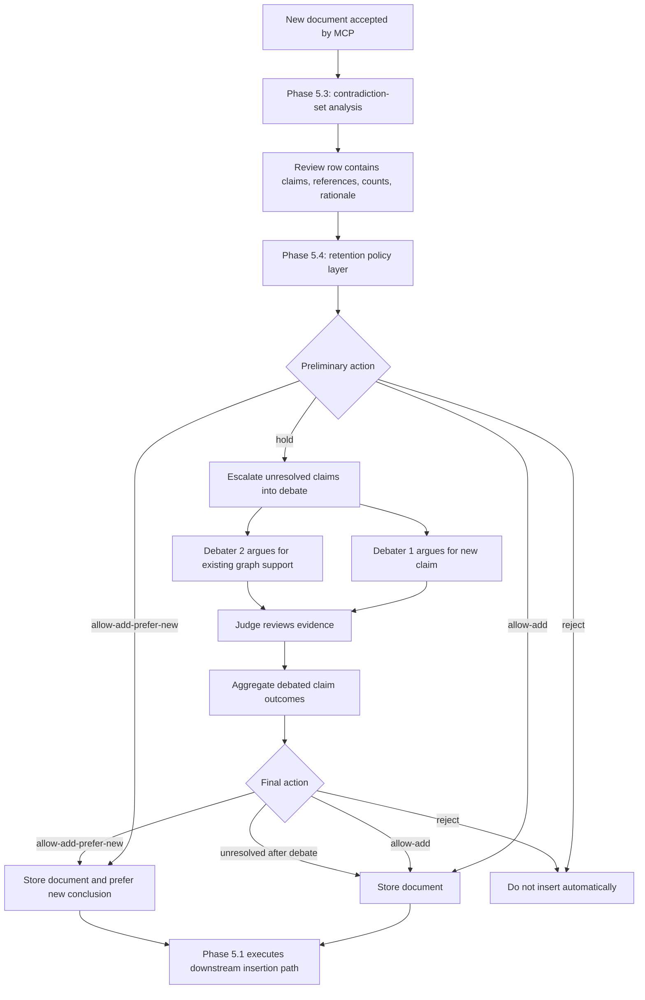

# Phase 5.4: Final Retention Decision and Debate Escalation

## Objective
Turn the structured contradiction review created in Phase 5.3 into a final retention outcome for the incoming document. The main decision basis should be the **contradiction set around the claim in the graph**, not whether the new document comes from the same source as an older document. Phase 5.4 should decide whether the document should be stored, whether its claim should become the currently preferred conclusion, whether the case should be held for deeper review, or whether it should be rejected.

This phase keeps the earlier Phase 5 idea of debate, but narrows it into a **targeted escalation tool** rather than the default decision path. Debate should only be used when the contradiction pattern is too ambiguous for automatic trust, especially for `hold` cases coming out of Phase 5.3.

---

## Why This Phase Is Needed

Phase 5.3 already adds contradiction detection and a structured review packet, but that still leaves one important gap: the system needs a clear policy for what to do **after** contradiction is detected.

Without Phase 5.4, the system would still be missing:

1. A consistent way to map contradiction-set structure into final retention actions.
2. A clear distinction between:
   - should this document be stored?
   - should this claim become the graph's preferred conclusion?
3. A way to avoid the common mistake of treating "same source" versus "different source" as the main criterion.
4. A disciplined escalation path for ambiguous contradiction cases instead of sending every dispute into multi-round debate.
5. A downstream handoff from policy decisions into the existing Phase 5.1 LightRAG insertion modes.

So Phase 5.4 is really four tasks:

- read the contradiction-set signals produced in Phase 5.3
- map those signals into one of the final retention actions
- escalate only `hold` cases into debate
- hand the final action to the downstream insertion path defined in Phase 5.1

---

## Scope

### In Scope

- Consuming the contradiction review packet created in Phase 5.3
- Using contradiction-set structure as the main retention policy input
- Defining the retention action vocabulary: `allow-add`, `allow-add-prefer-new`, `hold`, `reject`
- Distinguishing retained evidence from preferred conclusion
- Escalating ambiguous cases into targeted debate
- Updating the existing review-table row with the final policy outcome
- Handing the final action to Phase 5.1's transport and merge behavior
- Logging why the final action was selected

### Out of Scope

- Duplicate recapture handling already addressed in earlier phases
- Redesigning LightRAG storage schema
- Replacing Phase 5.1 insertion mechanics with a new transport layer
- Full human-review product UX beyond a minimal hold state
- Treating raw source identity alone as a retention rule

---

## Requirements

### Functional Requirements

1. Phase 5.4 must consume the contradiction review packet produced by Phase 5.3 rather than recomputing the whole contradiction set from scratch.
2. The primary policy signals must be contradiction-document count, contradictory-source count, existing graph viewpoint diversity, and whether the new document provides decisive evidence.
3. The incoming document's own source identity must not be the main criterion for retention or rejection.
4. Multiple contradictory documents from the same source lineage must be treated as weaker support than multiple contradictory documents from independent sources.
5. Phase 5.4 must distinguish between:
   - whether the incoming document should be stored
   - whether the incoming document should become the preferred conclusion
6. Phase 5.4 must first produce exactly one preliminary action: `allow-add`, `allow-add-prefer-new`, `hold`, or `reject`.
7. `allow-add` must mean the document is worth storing, even if its claim does not necessarily become the graph's preferred conclusion.
8. `allow-add-prefer-new` must mean the document is stored and its claim should become the currently preferred conclusion.
9. `reject` must mean the document should not be added to LightRAG automatically because the contradiction set already provides materially stronger opposing support.
10. `hold` must mean the available evidence is too sparse, mixed, or ambiguous for automatic trust.
11. Debate should be the main automatic escalation path for `hold` cases, not for every contradictory case.
12. Debate must focus on the disputed claim cases selected by Phase 5.3 instead of re-running whole-document reasoning from scratch.
13. Both debaters must query LightRAG directly for graph-backed evidence; they should not rely on the MCP-side claim-extraction LLM path as their main reasoning backend.
14. Debate must run claim by claim until each unresolved claim receives a judge result or the maximum round count is reached.
15. The maximum debate round count should default to `3` and be configurable through `MAX_DEBATE_ROUNDS` in the local MCP server environment.
16. After each claim debate finishes, the system should update the same article-level JSON result in the general shape documented by `phases/phase5/phase5-3/schema5-3.md`.
17. After all disputed claims are processed, one final aggregation step should re-evaluate the full article and decide the final retention outcome.
18. That final post-debate outcome must not be `hold`; if the aggregation still cannot justify preference or rejection, it should fall back to `allow-add`.
19. The final action must be handed downstream to the Phase 5.1 insertion layer, which decides the concrete LightRAG transport behavior.
20. The system must preserve the possibility that a document is retained without becoming the preferred fact.
21. Phase 5.4 should extend the existing Phase 5.3 structured contradiction query so the same LightRAG response also returns policy-ready contradiction-set signals.
22. This extension should modify the Phase 5.3 prompt and validation contract incrementally rather than redesigning Phase 5.3 from scratch.
23. If pre-debate policy evaluation fails unexpectedly, the safe default should be `hold`.

### Data Requirements

- The final policy layer should receive the Phase 5.3 review row or equivalent packet
- The packet should include:
  - document identity
  - new-side claims
  - contradictory references returned from LightRAG
  - contradictory-document count
  - contradictory-source count
  - indication of whether the graph already contains multiple views
  - indication of whether the new document appears decisive
  - indication of whether the evidence is insufficient for automatic trust
  - the Phase 5.3 rationale
  - the Phase 5.3 recommended action if one exists
- The final review state should record:
  - the chosen final action
  - why that action was selected
  - whether debate ran
  - which claims entered debate
  - whether the document was retained
  - whether the document became the preferred conclusion

---

## Implementation Approach

Phase 5.4 should use one approach: **treat Phase 5.3 as the contradiction-set analysis layer, extend the existing Phase 5.3 query so it returns policy-ready contradiction-set signals, and then apply a compact retention-policy matrix that only escalates unresolved `hold` cases into debate before handing the final action to Phase 5.1**.

This is the best fit for the current design:

- it stays aligned with Phase 5.3's structured contradiction review packet
- it avoids a second free-form LLM pass by asking the original LightRAG query to return the signals Phase 5.4 needs
- it preserves the Phase 5.1 separation between policy and transport
- it keeps contradiction policy centered on evidence structure, not on source identity shortcuts
- it avoids unnecessary debate for cases that are already clear enough to accept or reject
- it still honors the Phase 5 umbrella design by keeping two debaters and one judge available for unresolved disputes
- it makes the system easier to reason about because every path ends in the same four-action vocabulary

### How it works

1. Phase 5.3 creates the contradiction review packet and writes the review-table row.
2. Phase 5.4 relies on a small extension to the Phase 5.3 LightRAG prompt so the same review packet also includes contradiction-set signals.
3. The policy layer evaluates the contradiction pattern using:
   - how many contradictory documents were retrieved
   - how many independent sources those contradictions come from
   - whether the graph already preserves multiple plausible viewpoints
   - whether the new document is strong enough to become the preferred conclusion
4. The policy layer chooses a preliminary action:
   - `allow-add`
   - `allow-add-prefer-new`
   - `hold`
   - `reject`
5. If the preliminary action is `allow-add`, `allow-add-prefer-new`, or `reject`, the system does not need debate.
6. If the preliminary action is `hold`, the disputed claims are escalated into the Phase 5 debate workflow.
7. The debaters argue only about the unresolved claim cases, and the judge returns claim-level outcomes.
8. A final aggregation step converts the claim-level outcomes back into one of the same final actions.
9. The review-table row is updated with the final action, final rationale, and whether debate occurred.
10. The final action is handed to Phase 5.1, which decides the concrete insertion method.

### Debate configuration

- `MAX_DEBATE_ROUNDS` should default to `3`
- this value should live in `services/local-mcp-server/.env`
- the local MCP server should expose a helper to read it now, even before the full debate loop is implemented
- when the configured value is missing or invalid, the runtime should fall back to `3`

### Preliminary action derivation

The `Preliminary action` should not come from a second broad LLM judgment. Instead, it should be computed from a small set of policy-ready signals returned by the existing structured LightRAG contradiction query from Phase 5.3.

That means the implementation should:

- keep the current Phase 5.3 contradiction query as the main retrieval and classification call
- extend that prompt so LightRAG also returns contradiction-set signals needed by Phase 5.4
- validate those new fields against an extended result schema
- compute the preliminary action with explicit policy rules in MCP

This keeps responsibilities clear:

- LightRAG plus the LLM returns semantic signals
- Phase 5.4 maps those signals into `allow-add`, `allow-add-prefer-new`, `hold`, or `reject`

The most important signals are:

- `contradictoryDocumentCount`
- `contradictorySourceCount`
- `hasMultiViewExisting`
- `hasDecisiveNewEvidence`
- `hasInsufficientEvidence`
- optional old-side support strength if needed for stricter reject logic

### Likely implementation areas

- `services/local-mcp-server/src/contradiction/`
- `services/local-mcp-server/src/contradiction/review.ts`
- a Phase 5.4 decision module such as `services/local-mcp-server/src/contradiction/policy.ts`
- a Phase 5.4 debate module such as `services/local-mcp-server/src/contradiction/debate.ts`
- `services/local-mcp-server/src/index.ts`
- `services/local-mcp-server/src/lightrag/sync.ts`
- Phase 5.2 replay or developer scripts that surface final retention outcomes

### Trade-offs

- A policy matrix is simpler and more inspectable than always using debate, but it depends on Phase 5.3 producing good contradiction-set signals
- Restricting debate to `hold` cases reduces cost and complexity, but it means the automatic matrix must be conservative
- Separating "store this source" from "prefer this fact" makes the behavior more faithful, but it adds another concept developers must track
- Using contradiction-document count and source-count as primary signals is more robust than raw source identity, but retrieval quality still matters
- Keeping Phase 5.1 as the transport owner avoids design drift, but it requires a clean handoff contract between policy and insertion

---

## Design

### 0. Cross-Phase Flow

Phase 5.3 and Phase 5.4 should work together like this:

- Phase 5.3 performs contradiction-set detection and creates a review packet
- Phase 5.3 recommends or derives a preliminary retention action
- Phase 5.4 finalizes that action
- Phase 5.4 only runs debate when the case remains `hold`
- Phase 5.1 performs the downstream insertion mechanics based on the final action



This refined flow keeps the original debate idea from `phase5.md`, but uses it more precisely. Debate is no longer the default answer to every contradiction. It is the escalation path for cases where the contradiction set is real but still not strong enough for a clean automatic decision.

### 1. Use contradiction-set structure as the main decision basis

Phase 5.4 should explicitly reject one common shortcut: whether the new document comes from the same source as an older document should **not** be the main retention rule.

The stronger questions are:

- how many contradictory documents were retrieved?
- do those contradictory documents come from one source lineage or several independent sources?
- does the graph already preserve multiple coexisting viewpoints?
- is the new document strong enough to become the preferred conclusion?

This means contradiction policy is about the **structure of support around the claim**, not about a simple source-identity check.

### 2. Contradiction-set signals

Phase 5.4 should consume the following normalized signals from the extended Phase 5.3 response:

- `no-conflict`: no meaningful contradictory evidence was retrieved
- `one-doc-conflict`: exactly one contradictory document was retrieved
- `multi-doc-single-source-conflict`: multiple contradictory documents were retrieved, but they come from one source lineage
- `multi-doc-multi-source-conflict`: multiple contradictory documents were retrieved, and they come from multiple independent sources
- `multi-view-existing`: the graph already preserves more than one plausible view on the issue
- `decisive-new-evidence`: the new document contributes stronger, newer, or more authoritative support than the current preferred side
- `insufficient-evidence`: retrieval quality is weak, mixed, or too ambiguous for automatic trust

These signals can coexist. For example:

- `multi-doc-multi-source-conflict` plus `decisive-new-evidence`
- `multi-view-existing` plus `insufficient-evidence`
- `one-doc-conflict` plus `decisive-new-evidence`

So Phase 5.4 should not treat them as a one-hot label. It should treat them as a compact evidence summary.

### 3. Core insertion principles

The retention-policy layer should follow these principles:

- the incoming document's own source identity should not decide retention by itself
- contradiction strength should be judged mainly by contradictory-document count plus contradictory-source count
- multiple contradictory documents from the same source are weaker than multiple contradictory documents from independent sources
- cross-document contradiction is a policy problem before it is an API-selection problem
- the system must distinguish "should this source be stored?" from "should this claim become the preferred fact?"
- a document can be worth storing even when its claim should not become the graph's preferred conclusion

These principles are important because they keep the system from collapsing two different questions into one:

1. Is this new source worth preserving in the graph?
2. Should this new source now define the graph's preferred answer?

### 4. Policy matrix

Phase 5.4 should apply this default mapping from contradiction-set structure into final retention actions:

| Case | Signal pattern | Default action | Reason |
|------|----------------|----------------|--------|
| No contradictory evidence | `no-conflict` | `allow-add` | No meaningful opposing support was found |
| Single contradictory document | `one-doc-conflict` | `hold` | One opposing document is not strong enough for clean rejection or clean acceptance |
| Multiple contradictory docs from one source | `multi-doc-single-source-conflict` | `hold` | Repeated contradiction from one lineage is stronger than one doc, but weaker than independent corroboration |
| Multiple contradictory docs from multiple sources | `multi-doc-multi-source-conflict` and old-side support materially stronger | `reject` or conservative `hold` | Independent opposing support is materially stronger and should usually block automatic insertion |
| Graph already contains multiple views | `multi-view-existing` without decisive new evidence | `allow-add` | The graph is already representing disagreement, so another plausible view may be retained |
| Decisive new evidence | `decisive-new-evidence` | `allow-add-prefer-new` | The new side is strong enough to become the preferred conclusion |
| Insufficient evidence | `insufficient-evidence` | `hold` | The evidence is too weak or mixed for automatic trust |

This table should be treated as the default routing policy, with one important override rule:

- `decisive-new-evidence` may override weaker conflict signals and produce `allow-add-prefer-new`

For example:

- `one-doc-conflict` plus `decisive-new-evidence` should normally become `allow-add-prefer-new`
- `multi-view-existing` plus no decisive evidence should normally remain `allow-add`
- `multi-doc-multi-source-conflict` plus `insufficient-evidence` should normally stay conservative as `hold`

### 5. Meaning of the action vocabulary

The four action labels should have explicit semantics:

#### `allow-add`

- store the new document in LightRAG
- preserve it as part of the graph's evidence base
- do not necessarily elevate its claim above the current preferred conclusion
- use when the contradiction set is weak, plural, or already multi-view

#### `allow-add-prefer-new`

- store the new document in LightRAG
- let the new document become the preferred conclusion for overlapping facts
- use when the new evidence is strong enough to outweigh the old preferred side
- this is the only action that should intentionally shift the graph's preferred answer toward the new side

#### `hold`

- do not insert automatically yet
- keep the document and review packet available while the contradiction set is still unresolved
- use it as a temporary escalation state before targeted debate runs
- use when support is sparse, mixed, or difficult to interpret safely

#### `reject`

- do not insert automatically
- record that the old-side contradiction set was materially stronger
- use when multiple independent opposing sources already support the current conclusion strongly enough that the new document is not worth automatic retention

### 6. Debate is a fallback, not the default

The original Phase 5 framing described Phase 5.4 mainly as a debate system. This plan keeps that capability, but narrows its role:

- clear `allow-add` cases should bypass debate
- clear `allow-add-prefer-new` cases should bypass debate
- clear `reject` cases should bypass debate
- only `hold` cases should automatically enter debate

This matters for both quality and cost:

- the debate agents spend effort only where the contradiction set is genuinely ambiguous
- the final policy remains easier to audit because straightforward cases are decided by a transparent matrix
- the debate system becomes a high-value resolver rather than a universal classifier

### 7. Debate should operate at the claim level

When a case is held, the debate layer should consume the disputed claim cases already selected in Phase 5.3.

That means:

- each debated case should correspond to one unresolved claim
- Debater 1 argues that the new claim deserves retention or preference
- Debater 2 argues that the current graph-side support should remain preferred or should block insertion
- both debaters should call the LightRAG `query` interface to gather graph-backed evidence for their side
- the debate path should not use the MCP-side claim-extraction LLM as the main evidence engine
- the judge should return a structured verdict for each claim
- the claim verdicts should then be aggregated into one final document-level action

The aggregation rule should stay within the same policy vocabulary:

- if debate shows the new side is worth storing but not preferring, final action becomes `allow-add`
- if debate shows the new side should become preferred, final action becomes `allow-add-prefer-new`
- if debate shows the old side is materially stronger, final action becomes `reject`
- if debate still cannot resolve the case, default the final action to `allow-add`

### 7.5 Debate lifecycle per claim

The intended debate loop should be:

1. Select only the claims whose preliminary outcome still requires debate.
2. Start one claim-level debate case for each unresolved claim.
3. In each round:
   - Debater 1 queries LightRAG and argues for the new claim
   - Debater 2 queries LightRAG and argues for the currently preferred graph-side support
   - the judge reviews both arguments plus cited evidence
4. If the judge resolves the claim early, stop debating that claim.
5. If the judge cannot resolve the claim, start another round until `MAX_DEBATE_ROUNDS` is reached.
6. When the claim finishes, write its updated result back into the same article-level JSON object.
7. After all debated claims finish, run one final article-level aggregation pass.
8. That aggregation pass may output `allow-add`, `allow-add-prefer-new`, or `reject`; if it would otherwise remain unresolved, downgrade to `allow-add` instead of re-entering `hold`.

This is important because the system should not create a second disconnected debate result format. The debate loop should progressively rewrite the same article-level result object rather than inventing a separate claim-debate storage model.

### 7.6 Update the existing article JSON instead of creating a second result schema

The debate system should reuse the Phase 5.3 article-level JSON shape as the canonical review artifact.

That means:

- the top-level `classification`, `summary_reason`, and `claims` object remain the main result shape
- each debated claim should update its own claim-level fields in that same JSON
- the final aggregation step should update the top-level article result after all claim debates finish
- Phase 5.4 may add lifecycle or policy metadata around this object, but it should not replace the core article-level contradiction JSON defined in `schema5-3.md`
- once updated, the final JSON should be written back into the same SQLite review row

### 7.7 Role split inside the debate loop

The three debate actors should not use the same evidence path:

- Debater 1 should use LightRAG `query` and argue for the new claim
- Debater 2 should use LightRAG `query` and argue for the currently preferred graph-side support
- the Judge should use the MCP-side LLM only

This split is intentional:

- both debaters need direct access to graph-backed retrieval because they are arguing over the same knowledge graph from different positions
- the Judge should stay retrieval-light and instead evaluate the quality of the two arguments, their cited references, and the cross-round responses
- this prevents the Judge from becoming a hidden third retriever with a different evidence window than the debaters

### 7.8 Multi-round context inheritance

When a claim enters round 2 or later, each debater should receive all of the following:

- the original claim case from Phase 5.3
- the debater's fixed stance
- the debater's own prior-round argument
- the opponent's prior-round argument
- the Judge's prior feedback
- the claim's current running state

This matters because later rounds are not fresh first impressions. They are rebuttal rounds. The goal is to let each side answer the strongest version of the opposing case rather than re-generating disconnected arguments each time.

### 7.9 Claim debate does not rewrite the original contradiction classification

Phase 5.3 already produced the initial article-level contradiction result. Phase 5.4 should not reinterpret that original contradiction label as if it were a final post-debate truth label.

So the design should treat the fields differently:

- `classification` in the original article JSON still means the Phase 5.3 pre-debate contradiction result
- claim-level debate should add new fields describing the debate outcome
- the final post-debate article decision should come from a second policy pass, not from mutating the meaning of the original contradiction label

In other words:

- Phase 5.3 answers: did the new document appear contradictory or uncertain before debate?
- Phase 5.4 answers: after debate, what should we do with this document?

### 7.10 Claim-level debate outcome model

Each debated claim should end in a compact outcome that is easier to aggregate than the original contradiction labels.

The recommended claim-level debate outcomes are:

- `retain`
- `prefer-new`
- `reject`

Do not keep `hold` as a final claim-debate result. If the maximum rounds are exhausted and the Judge still cannot reach a strong conclusion, the claim should fall back to:

- `retain`
- with `low_confidence = true`

This keeps the final article aggregation simpler and prevents the workflow from re-entering debate recursively.

### 7.11 Final article aggregation pass

After all debated claims are resolved, the system should run one more MCP-side LLM step that summarizes the whole article again.

That final aggregation step should:

- read the updated article JSON
- read the claim-level debate outcomes
- re-evaluate the article's post-debate policy state
- produce updated article-level policy metadata
- choose the final action

The final action may be:

- `allow-add`
- `allow-add-prefer-new`
- `reject`

It must not be `hold`.

If the final aggregation still cannot justify `allow-add-prefer-new` or `reject`, it should default to `allow-add` and mark the result as `low_confidence = true`.

### 7.12 Final low-confidence behavior

The system should preserve uncertainty information even when it must exit debate with a non-`hold` final action.

So the final stored result should support:

- a normal high-confidence `allow-add`
- a normal high-confidence `allow-add-prefer-new`
- a normal high-confidence `reject`
- a fallback low-confidence `allow-add`

This allows the system to avoid endless debate loops while still preserving that the final decision was cautious rather than strongly confident.

### 8. Keep retained evidence separate from preferred conclusion

One of the most important design rules in this phase is that "retain" and "prefer" are not the same operation.

Examples:

- a plausible minority viewpoint in an already contested topic may be retained with `allow-add`, even if it does not become the preferred answer
- a newer official correction may both be retained and become preferred with `allow-add-prefer-new`
- an unsupported outlier may be rejected even though it came from a familiar source

This separation should stay visible in both code and stored review output.

### 9. Downstream handoff into Phase 5.1

Phase 5.4 should not own the transport-level LightRAG API decision. That remains a Phase 5.1 concern.

Instead, the design should distinguish between the pre-debate action space and the post-debate final action space:

```ts
type PreliminaryRetentionAction =
  | "allow-add"
  | "allow-add-prefer-new"
  | "hold"
  | "reject"

type FinalRetentionAction =
  | "allow-add"
  | "allow-add-prefer-new"
  | "reject"
```

And a final policy result such as:

```ts
type FinalRetentionDecision = {
  captureId: number
  action: FinalRetentionAction
  retained: boolean
  preferNew: boolean
  usedDebate: boolean
  lowConfidence: boolean
  rationale: string
  claimOutcomes: Array<{
    claim: string
    outcome: "retain" | "prefer-new" | "reject"
  }>
}
```

Phase 5.1 can then interpret the final action as:

- `allow-add` -> use the normal insertion path
- `allow-add-prefer-new` -> use the overwrite-preference path
- `reject` -> do not insert

This keeps contradiction policy separate from delivery mechanics while making it explicit that `hold` is only a pre-debate state.

### 9.5 Prompt and schema extension contract

Phase 5.4 should explicitly add one implementation task on top of Phase 5.3: keep the same contradiction-query flow, but extend the Phase 5.3 prompt so the model returns both:

- the original contradiction classification fields
- the additional contradiction-set signals needed for preliminary action

The canonical Phase 5.4 extension contract should live in:

- `phases/phase5/phase5-4/schema5-4.md`
- `phases/phase5/phase5-4/prompt5-4.md`

Those files should define:

- the signal fields added on top of the Phase 5.3 response
- the meaning of each field
- how the preliminary action is derived from those fields
- how this extension relates back to the original Phase 5.3 prompt and schema
- how claim-level debate results are recorded
- how the final aggregation result is recorded

### 10. Review-table lifecycle

Phase 5.3 already introduced one lightweight review-table row per document candidate. Phase 5.4 should reuse that same row and extend it with final policy output.

The row should make it easy to answer:

- what contradiction-set signals were observed?
- what preliminary action was chosen?
- did the case enter debate?
- what was the final action?
- was the document retained?
- did the new claim become preferred?
- what did the post-debate article JSON finally say?
- was the final result low confidence?

This can stay behind a lightweight stored shape such as:

```ts
type FinalReviewState = {
  captureId: number
  url: string
  resultJson: unknown
  enteredDebate: boolean
  finalAction?: "allow-add" | "allow-add-prefer-new" | "reject"
  retained: boolean
  preferNew: boolean
  lowConfidence: boolean
}
```

The core rule should be:

- before debate, `finalAction` may still be absent or equal to the preliminary action
- after debate, `finalAction` must no longer remain `hold`
- if the final action is a fallback `allow-add`, `lowConfidence` should make that visible

---

## Development Steps

1. Confirm the exact review-packet fields handed from Phase 5.3 into Phase 5.4.
2. Extend the existing Phase 5.3 contradiction prompt so the same LightRAG query also returns contradiction-set signals needed for Phase 5.4.
3. Document that extended response contract in `phases/phase5/phase5-4/schema5-4.md`.
4. Document the prompt extension and prompting rules in `phases/phase5/phase5-4/prompt5-4.md`.
5. Add a policy module that converts contradiction-set signals into the four final actions.
6. Encode the default policy matrix, including the decisive-evidence override behavior.
7. Add explicit helpers that separate `retained` from `preferNew` so later code does not collapse them into one flag.
8. Add a debate entrypoint that runs only when the preliminary action is `hold`.
9. Reuse the disputed claim cases from Phase 5.3 so debate stays claim-scoped.
10. Add a debater prompt path where both sides query LightRAG directly from opposite stances.
11. Add a Judge prompt path that uses the MCP-side LLM only and never queries LightRAG directly.
12. Carry forward cross-round context including self argument, opponent argument, Judge feedback, and original stance.
13. Define a claim-level debate outcome shape with `retain`, `prefer-new`, `reject`, and `low_confidence`.
14. Update the article-level JSON after each claim finishes instead of writing a separate debate-only result artifact.
15. Add a final article-level aggregation prompt that recomputes post-debate policy state and chooses a non-`hold` final action.
16. Update the review-table row with preliminary action, final action, rationale, low-confidence state, and `enteredDebate`.
17. Hand the final policy action to the existing Phase 5.1 LightRAG sync logic.
18. Extend replay and inspection scripts so developers can see contradiction-set signals, chosen action, debate rounds, and whether the final result used low-confidence fallback.

---

## Deliverables

- [ ] A Phase 5.4 policy layer exists between Phase 5.3 contradiction analysis and Phase 5.1 insertion transport
- [ ] The policy layer uses contradiction-set structure as the main decision basis
- [ ] The incoming document's own source identity is not used as the main retention rule
- [ ] The system supports the signals `no-conflict`, `one-doc-conflict`, `multi-doc-single-source-conflict`, `multi-doc-multi-source-conflict`, `multi-view-existing`, `decisive-new-evidence`, and `insufficient-evidence`
- [ ] The Phase 5.3 contradiction prompt is extended to return policy-ready contradiction-set signals in the same response
- [ ] The Phase 5.4 signal extension contract is documented in `schema5-4.md`
- [ ] The Phase 5.4 prompt extension rules are documented in `prompt5-4.md`
- [ ] The system outputs one preliminary action from `allow-add`, `allow-add-prefer-new`, `hold`, or `reject`
- [ ] The design clearly distinguishes retention from preferred conclusion
- [ ] Debate is only required for unresolved `hold` cases
- [ ] Debate consumes claim-level cases produced in Phase 5.3
- [ ] Both debaters use LightRAG `query` as their evidence source
- [ ] The Judge uses the MCP-side LLM only
- [ ] Multi-round debate carries forward opponent arguments and Judge feedback
- [ ] Claim-level debate outcomes use `retain`, `prefer-new`, or `reject`
- [ ] Low-confidence fallback is available when max rounds are exhausted without a strong claim verdict
- [ ] Debate outputs are aggregated back into the same final action vocabulary
- [ ] The final post-debate action cannot remain `hold`
- [ ] A final low-confidence `allow-add` fallback exists for unresolved post-debate aggregation
- [ ] The review-table row is updated with the final action and whether debate occurred
- [ ] Phase 5.1 receives a transport-neutral retention decision rather than contradiction-policy logic

---

## Testing Plan

### Core Cases

1. Submit a document with no meaningful contradictory evidence and verify the final action is `allow-add`.
2. Submit a document with exactly one contradictory reference and verify the preliminary action is `hold`.
3. Submit a document with several contradictory references that all come from one source lineage and verify the preliminary action is `hold`.
4. Submit a document with several contradictory references from multiple independent sources and materially stronger old-side support and verify the preliminary action is `reject` or a conservative `hold`, depending on configured strictness.
5. Submit a document to a topic where the graph already preserves multiple views and verify a plausible new viewpoint can still become `allow-add`.
6. Submit a document with stronger, newer, or more authoritative support than the current preferred side and verify the final action is `allow-add-prefer-new`.
7. Submit a document where retrieval quality is sparse or mixed and verify the preliminary action is `hold`.
8. Verify that `hold` cases enter debate and non-`hold` cases do not.
9. Verify that both debaters query LightRAG, while the Judge uses only the MCP-side LLM.
10. Verify that round 2 and later rounds receive opponent arguments and Judge feedback from earlier rounds.
11. Verify that each debated claim writes its debate outcome back into the same article-level JSON.
12. Verify that the final aggregation step produces `allow-add`, `allow-add-prefer-new`, or `reject`, but never `hold`.
13. Verify that unresolved max-round cases can fall back to `retain` at the claim level with `low_confidence = true`.
14. Verify that low-confidence article-level fallback is recorded when final aggregation downgrades unresolved debate to `allow-add`.
15. Verify that the final decision is recorded in the same review-table row created by Phase 5.3.
16. Verify that retained documents and preferred conclusions are tracked separately in the stored result.

### Good Example Scenarios

- one company page update conflicts with exactly one prior page
- several cached copies from the same site conflict with the new page
- multiple independent news or official sources disagree with the new page
- a controversial question already has two stored viewpoints and the new document adds a third plausible position
- an official correction or newer authoritative notice should become the preferred conclusion
- retrieval surfaces mixed snippets that are too weak for automatic trust
- a claim that reaches max rounds without a strong winner and falls back to `retain` with `low_confidence = true`
- an article whose final aggregation falls back to low-confidence `allow-add`

### Automatic Versus Manual Checks

Automatic checks should cover:

- the contradiction-set signals extracted from the Phase 5.3 packet
- the chosen preliminary action
- whether debate was skipped or entered correctly
- whether both debaters used LightRAG-backed evidence
- whether the Judge stayed on the MCP-side LLM path only
- the final aggregated action
- whether `retained` and `preferNew` were set correctly
- whether `lowConfidence` was set correctly
- whether the review row was updated correctly
- whether Phase 5.1 received the correct downstream action

Manual developer review can cover:

- whether the contradiction-set signals matched human intuition
- whether the decisive-evidence override was justified
- whether the system was appropriately conservative in multi-source conflict cases
- whether retained-but-not-preferred outcomes look reasonable in multi-view topics
- whether low-confidence fallback was used too often or too rarely

---

## Risks and Mitigations

| Risk | Why it matters | Mitigation |
|------|----------------|------------|
| Retrieval undercounts contradictory sources | The system may over-trust a new document | Fail conservative toward `hold` when source diversity is uncertain |
| Retrieval overcounts duplicates from one lineage as independent support | The system may reject too aggressively | Normalize source lineage before counting independent sources |
| Source identity leaks back in as the hidden main rule | The policy becomes simpler but wrong | Keep decision rules centered on contradiction-set counts and viewpoint structure |
| Debate is triggered too often | The system becomes slow and expensive | Restrict debate to `hold` cases only |
| Debater and Judge evidence paths drift | Later rounds become hard to reason about | Keep debaters on LightRAG query and keep the Judge MCP-side only |
| Cross-round context gets dropped | Later rounds repeat low-value first-pass arguments | Explicitly persist opponent argument, self argument, and Judge feedback per round |
| Debate output invents a second decision vocabulary | Later routing becomes inconsistent | Force debate aggregation back into the same four final actions |
| Post-debate result still behaves like a hidden `hold` | The workflow can loop or stall | Forbid `hold` after final aggregation and fallback to low-confidence `allow-add` |
| Retention and preference get collapsed in implementation | The graph may over-promote weak sources | Keep `retained` and `preferNew` as separate explicit fields |

---

## Open Questions

1. How should source lineage be normalized so mirrors, cached copies, and near-duplicate syndications do not look like independent corroboration?
2. What minimum evidence threshold should let `multi-doc-multi-source-conflict` move from conservative `hold` to automatic `reject`?
3. How should the system score "stronger, newer, or more authoritative" when deciding `decisive-new-evidence`?
4. Should some `allow-add` multi-view cases still mark the new claim as non-preferred explicitly for later query behavior?
5. Should the final aggregation also emit a short machine-readable reason code for why a low-confidence fallback `allow-add` was used?

---

## Decision

For Phase 5.4, implement **a retention-policy layer that first consumes Phase 5.3 contradiction-set signals and maps them into the preliminary actions `allow-add`, `allow-add-prefer-new`, `hold`, or `reject`, and then, for unresolved `hold` cases, runs claim-level debate plus final aggregation to produce a non-`hold` final action**. Use contradiction-document count, contradictory-source count, viewpoint diversity, and decisive new evidence as the main decision basis. Do not use the incoming document's own source identity as the primary rule. Keep debate as a targeted escalation mechanism for unresolved `hold` cases only, preserve the distinction between retaining a source and preferring a fact, and hand the final post-debate action downstream to Phase 5.1 for actual LightRAG insertion behavior.
