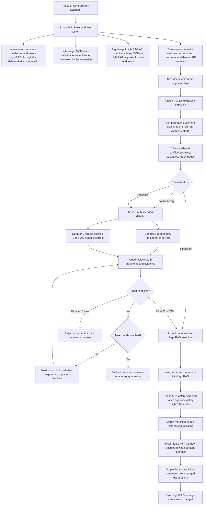

# Phase 5: Contradiction Evaluator

## Objective
Add an evaluator pipeline that prevents contradictory documents from being blindly added into LightRAG. The system should compare new documents against the current LightRAG graph, detect contradictions, and only ingest the new document when it survives a structured multi-agent review process.

## Current Situation & Challenges
1. **Graph updates can overwrite prior truth:** When new documents are added, newer extracted facts may conflict with existing graph knowledge.
2. **Contradictions are hard to detect automatically:** A simple merge strategy is not enough when the new document disagrees with the existing LightRAG graph.
3. **Single-pass judging may be unreliable:** If one LLM call cannot confidently decide which side is correct, we need a repeatable process that can refine arguments before making an ingestion decision.

## Framework

---

## Proposed Solutions

### 1. LightRAG Update Strategy
When new documents are ingested, newly extracted nodes that match existing nodes in the LightRAG graph should be merged instead of duplicated. Keep the existing LightRAG add-document interface behavior unchanged, and add a separate overwrite-style add-document interface for changed-document update flows. That new overwrite path should reuse as much of the existing add-document implementation as possible, but it should use the newest-first merge prompt and `operate.py` ordering so the new document can overwrite older conflicting facts in merged descriptions.

### 2. Reset and Test System
Before finishing the contradiction evaluator itself, add a test-support phase that makes repeated validation easier. This phase should extend `pnpm clean` so it clears the local databases and resets the LightRAG server through its existing delete-all-documents API, then add two lightweight developer scripts: one MCP-side script that calls the same entrance path used by the extension, and one LightRAG-side script that simulates the same requests the MCP server would send to newly added LightRAG interfaces. The evaluation of contradiction quality and deeper API semantics can stay manual for developers when the result is too hard to verify automatically.

### 3. Contradiction Detection Layer
Before committing a new document into the graph, run a contradiction detection step that compares the new document's extracted claims against the current LightRAG graph. This layer should decide whether the new document is compatible with the current graph, clearly contradictory, or uncertain and in need of deeper review.

### 4. Multi-Agent Debate and Judge
If contradiction is detected or the result is uncertain, run a debate system:

- **Debater 1:** Argues that the new document is correct.
- **Debater 2:** Argues that the current LightRAG graph (old documents) is correct.
- **Judge:** Reviews both arguments and decides which side is more credible.

If the judge cannot decide, both debaters run again with access to the opponent's feedback from the previous round. This repeats until the judge reaches a decision or the system hits a maximum number of rounds. If Debater 1 wins, the new document is added into the LightRAG graph.

---

## Implementation Plan (Draft)

### Phase 5.1: Update LightRAG Merge Behavior
- Keep the original LightRAG add-document API behavior unchanged.
- Add a new overwrite-add LightRAG document API for changed-document update flows.
- Reuse as much of the current add-document implementation as possible, with only targeted changes for overwrite behavior.
- Update the LightRAG ingestion flow so newly extracted nodes are matched against existing graph nodes during overwrite ingestion.
- Merge matching nodes instead of creating duplicates.
- Revise the merge prompt so the LLM is instructed to prefer information from the newly added nodes when there is overlapping content.
- In `services/lightrag/lightrag/operate.py`, pass descriptions into summarization in `newest -> oldest` order so the prompt's version-time rule is actually true at runtime.
- Keep merged node provenance lightweight in LightRAG for this phase, and prefer MCP-side audit/history if deeper traceability is needed.

### Phase 5.2: Build Reset and End-to-End Test Support
- Extend `pnpm clean` so it clears all local database state used by the MCP server.
- Make the clean flow also reset the LightRAG server through its existing delete-all-documents API.
- Add a lightweight MCP-side script that calls the same entrance function used by the extension capture flow.
- Use this script to make it easy to mimic a user capturing a web page from the extension without needing the extension UI itself.
- Add a lightweight LightRAG API script that simulates the same MCP-to-LightRAG requests used by newly added interfaces.
- Keep automatic checks focused on deterministic request and status behavior, and leave contradiction-quality plus deeper semantic evaluation to developer review.

### Phase 5.3: Add Contradiction Detection
- Add a contradiction detection step after extraction and before final graph insertion.
- Compare claims from the new document against the current LightRAG graph and classify the result as `consistent`, `contradictory`, or `uncertain`.
- Identify the minimum evidence format needed for the next stage, such as conflicting claims, supporting passages, and referenced graph nodes.
- Only send documents flagged as `contradictory` or `uncertain` into the debate pipeline.

### Phase 5.4: Debate System with Two Debaters and One Judge
- Build a multi-round reasoning workflow with Debater 1 supporting the new document and Debater 2 supporting the existing LightRAG graph.
- In each round, both debaters submit arguments and evidence to the judge.
- If the judge cannot decide, start another round where each debater can see and respond to the opponent's previous feedback.
- Stop when the judge selects a winner or when the system reaches the maximum allowed number of rounds.
- If Debater 1 wins, ingest the new document into LightRAG.
- If Debater 2 wins, reject the new document or mark it for manual review.
- If the maximum round limit is reached without a decision, define a safe fallback behavior such as manual review or temporary quarantine.
